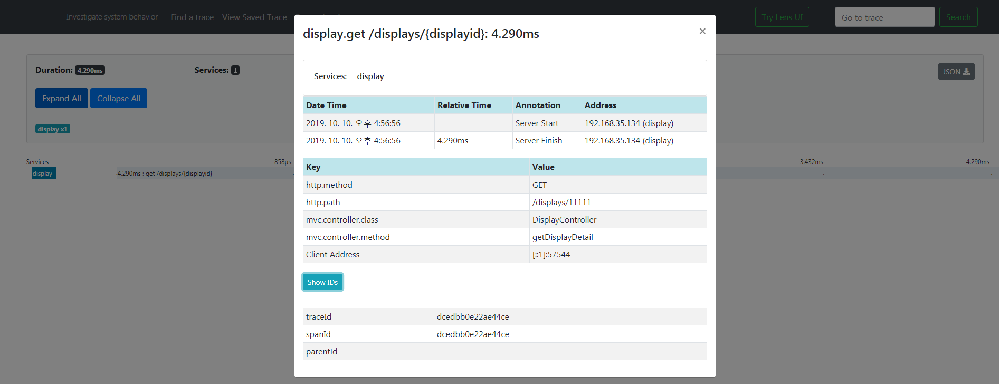
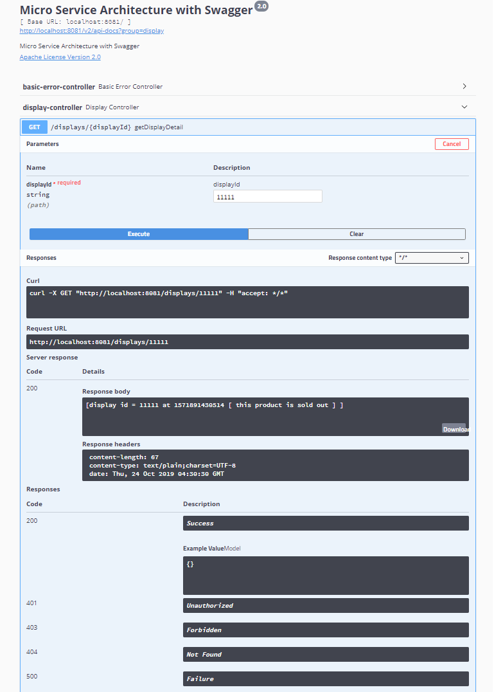

# SpringBoot-MSA-Workshop
[](https://gitter.im/MSA_miniProject/community)&nbsp;
[](https://spring.io/guides/gs/rest-service/)&nbsp;
&nbsp;

MSA Development Project with Spring Boot using Netflix OSS

# ■ Hystrix Dashboard
- Hystrix Dashboard는 앞의 Hystrix 설정에 따른 Circuit breaker의 상태를 모니터링 할 수 있는 dashboard를 제공해주는 라이브러리이다. 사실 라이브러리라기 보다는 솔루션에 가깝다고 할 정도로 간단한 설정으로 실행할 수 있다.
- Client 요청은 많은 traffic과 다양한 형태(예상하지 못한 형태)의 요청으로 경고없이 운영 이슈 발생 상황에 신속히 대응할 수 있는 시스템 zuul을 개발
- zuul은 이런한 문제를 신속하고, 동적으로 해결하기 위해서 groovy 언어로 작성된 다양한 형태의 Filter를 실행한다.
- Filter에 기능을 정의하고, 이슈사항에 발생시 적절한 filter을 추가함으로써 이슈사항을 대비할 수 있다.

### Netflix Filter 기능

- Authentication and Security : 클라이언트 요청시, 각 리소스에 대한 인증 요구 사항을 식별하고 이를 만족시키지 않는 요청은 거부
- Insights and Monitoring : 의미있는 데이터 및 통계 제공
- Dynamic Routing : 필요에 따라 요청을 다른 클러스터로 동적으로 라우팅
- Stress Testing : 성능 측정을 위해 점차적으로 클러스터 트래픽을 증가
- Load Shedding : 각 유형의 요청에 대해 용량을 할당하고, 초과하는 요청은 제한
- Static Response handling : 클러스터에서 오는 응답을 대신하여 API GATEWAY에서 응답 처리

[Zuul Core Architecture]


### Zuul의 build.gradle에 dependency 추가
```
compile('org.springframework.cloud:spring-cloud-starter-netflix-hystrix-dashboard')
compile('org.springframework.boot:spring-boot-starter-actuator')
```

### Zuul의 application.yml에 management 추가
```yaml
spring:
  application:
    name: zuul

server:
  port: 8765

management:
  security:
    enabled: false
  endpoints:
    web:
      exposure:
        include: hystrix.stream
      base-path: /
```

### ZuulApplication.java에 Annotation 추가
```java
@EnableZuulProxy
@EnableDiscoveryClient
@SpringBootApplication
@EnableHystrixDashboard
@EnableTurbine

public class ZuulApplication {

    public static void main(String[] args) {
        SpringApplication.run(ZuulApplication.class, args);
    }
}
```

### Hystrix Dashboard Connction
[Hystrix Dashboard]


[Hystrix Stream]


# ■ Spring Sleuth를 이용한 Zipkin 연동
- application에서 Distributed Log Trace를 해보자.
Spring Boot application을 Zipkin과 연동하기 위해서는 Sleuth라는 Library를 사용하면 된다.

### MicroService의 build.gradle에 Zipkin 및 Sleuth dependency 추가
```
compile('org.springframework.cloud:spring-cloud-starter-zipkin')
compile('org.springframework.cloud:spring-cloud-starter-sleuth')
```

### MicroService의 application.yml에 zipkin 및 sample 추가
```yaml
spring:
  application:
    name: display

  zipkin:
    baseUrl: http://127.0.0.1:9411/
    sleuth:
      enabled: true
      sampler:
        probability: 1.0

  sample:
    zipkin:
      enabled: true
```

### MicroService의 Controller에 Annotation 추가
```java
public class DisplayController {
    @Autowired
    RestTemplate restTemplate;
    @Bean
    public RestTemplate getRestTemplate() {
        return new RestTemplate();
    }
    @Bean
    public Sampler alwaysSampler() {
        return Sampler.ALWAYS_SAMPLE;
    }
```
- alwaysSampler() 정의를 통해 Tracing Transaction Rate를 결정 가능

### Zipkin 서버 구동
- jar 파일을 다운 받은 후에, java -jar로 서버를 구동하는게 간편하다.
※ 유의사항 : zipkin 서버를 통해서 HTTP로 Trace Log를 받을 때, 별도의 보안이나 인증 메커니즘이 없기 때문에 zipkin 서버는 반드시 방화벽 안에 놓고 서비스 서버로부터만 HTTP 호출을 받을 수 있도록 해야 한다.

```
> wget -O zipkin.jar   <-- Download
> java -jar zipkin.jar <-- Server 구동
```

### Zipkin을 통한 결과 확인
- 서비스 구동
- http://localhost:9411 Zipkin Server 접속
- Find Traces를 통한 개별 Transaction 확인

[Trace Result]




---
# ■ Swagger 연동
Usage of Swagger 2.0 in Spring Boot Applications to document APIs

- Source Code내에서 annotation을 통해 직접 API를 문서화할 수 있다.

### MicroService의 build.gradle에 Swagger dependency 추가
```
compile('io.springfox:springfox-swagger2:2.9.2')
compile('io.springfox:springfox-swagger-ui:2.9.2')
```

### MicroService의 Application에 Annotation 및 @Bean 추가
```java
@EnableSwagger2
...
@Bean
public Docket newsApi() {
    return new Docket(DocumentationType.SWAGGER_2)
        .groupName("display")
        .apiInfo(apiInfo())
        .select()
        .build();
}
 
private ApiInfo apiInfo() {
    return new ApiInfoBuilder()
        .title("Micro Service Architecture with Swagger")
        .description("Micro Service Architecture with Swagger")
        .license("Apache License Version 2.0")
        .version("2.0")
        .build();
    }
...

```

### MicroService의 Controller에 @ApiResponses 추가
```java
@ApiResponses(value = { 
  @ApiResponse(code = 200, message = "Success", response = DisplayApplication.class),
  @ApiResponse(code = 401, message = "Unauthorized"),
  @ApiResponse(code = 403, message = "Forbidden"),
  @ApiResponse(code = 404, message = "Not Found"),
  @ApiResponse(code = 500, message = "Failure")}) 
```
### Swagegr Run

- http://localhost:8081/swagger-ui.html#/

[Result]
