# SpringBoot-MSA-Workshop
[](https://gitter.im/MSA_miniProject/community)&nbsp;
[](https://spring.io/guides/gs/rest-service/)&nbsp;
&nbsp;

MSA Development Project with Spring Boot using Netflix OSS


# ■ Monolithic -> SOA -> MSA

- Application 개발 초기에는 기존 application에 최소한의 변경 사항이 있어도 자체 QA(Quality Assurance) 주기에 따라 대규모 update를 해야 했다.
- 전체 application의 source code는 하나의 배포 unit(.war or .ear 등)으로 내장되기 때문에 이런 방식을 `Monolithic`이라고 부른다.
- 일부 application의 update로 인해 오류가 발생할 경우, 전체를 offline으로 전환하고 운영 규모를 축소시킨 다음 문제를 해결해야 했다. 이러한 방식은 소규모 application션에서 여전히 실행 가능하지만, 성장하는 기업들은 downtime을 감당할 수 없다.


- `Service Oriented Architecture(SOA)`는 application을 별개의 재사용 가능한 서비스 단위로 분할하며, 이 service들은 `Enterprise Service Bus(ESB)`를 통해 통신한다.
- 특정 Business Process를 기반으로 구성된 개별 서비스가 통신 프로토콜(SOAP, ActiveMQ, Apache Thrift 등)을 준수하며 ESB를 통해 공유된다. 즉, 이러한 서비스 요소가 ESB를 통해 통합되어 하나의 애플리케이션을 구성한다.
- 서비스의 구축, 테스트, 수정을 동시에 수행할 수 있기 때문에 더 이상의 monolithic 개발 주기는 필요가 없다. 그러나 ESB는 전체 시스템의 단일 장애점(single point of failure)을 나타내기 때문에 이러한 방식에서 monolithic 제거는 새로운 monolithic을 만들어낼 뿐이며, 잠재적으로 ESB가 전체 조직의 자체적인 장애 요소로 작용할 수 있다.


- `Microservice`는 Stateless 방식으로 서로 통신을 할 수 있으므로, 이러한 방식으로 구축된 application은 내결함성이 더 높고 단일 ESB에 대한 의존성은 더 낮다.
- Microservice가 programing 언어에 구속 받지 않는 API이기 때문에 개발팀이 자체 tool을 선택할 수도 있다.
- SOA의 본질적 기능을 감안하면 microservice는 완전히 새로운 개념은 아니다. microservice는 `Containerized` 기술의 발달에 힘입어 유용성이 향상되었다.
- Linux Container를 활용해 application의 여러 조각들을 독립적으로 작동시킬 수 있으며, 각 개별 요소 및 lifecycle에 대한 통제력은 훨씬 강화되었다.
- Containerized Microservice는 API 및 `DevOps`와 함께 Cloud Native Application의 기반이 된다.

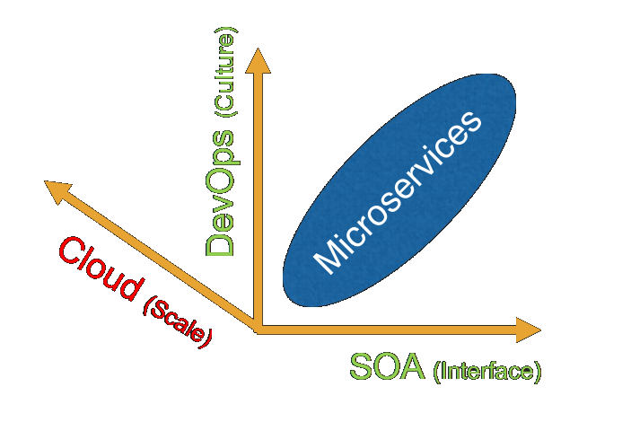


# ■ MSA Components

- `Container Management` : 개별 service instanece에는 작동할 context가 필요한데 VM, Docker container 또는 조정된 process로 구현된 관리 container는 이러한 기능을 제공한다. instance 관리 및 조정을 제공하고 필요에 따라 개별 인스턴스의 lifecycle를 관리한다.

- `External Gateway` : 서비스에 대한 access를 관리하고 traffic 관리 및 보안 정책을 적용하여 microservice 환경을 보호한다. 외부 게이트웨이 기능은 종종 API 관리 제품을 사용하여 구현된다.

- `Service Mesh` : 서비스 간의 통신을 느슨하게 결합, 신뢰성 및 유연성을 유지하는 데 도움이되는 기능으로 구성되며, 이러한 기능을 통해 서비스 분리, 버전 관리 전략 지원 및 부하시 탄성 확장성 관리가 가능하다.
  - `Service Router` : 클라이언트 응용 프로그램에서 또는 마이크로 서비스 사이의 요청은 구성 및 정책에 따라 올바른 마이크로 서비스로 라우팅해야 한다.
  - `Load Balanceing` : 각 마이크로 서비스의 인스턴스는 확장 성을 지원하기 위해로드 밸런싱이 필요하며, 로드 밸런싱의 세밀성 및 구성은 각 서비스를 관리하는 팀에 의해 제어되야 한다.
  - `Service Discovery` : 서비스는 느슨하게 결합 된 방식으로 서비스 레지스트리를 사용하여 구현되며, 이 서비스 레지스트리에서 마이크로 서비스 소유자는 런타임에 다른 서비스가 필요로 하는 정보를 등록 및 구성하여 찾아서 호출 할 수 있다. 마이크로 서비스간에 존재할 종속성을 관리하는데 도움을 주며 환경 변화를 관리할 때 중요하다.
  - `Config. Store` : 서비스 인스턴스는 마이크로 서비스와 전체 환경과 관련된 구성을 공유해야 한다. 예를 들어, 환경에 배포된 마이크로 서비스에는 서비스 검색 레지스트리의 위치와 로그 이벤트를 내보내는 위치를 파악하는 방법이 필요한데 분산 특성으로 인해 분산 키-값 저장소를 사용하여 구현되는 경우가 많다.
  - `Identity Provider` : 서비스 인스턴스는 신뢰할 수 있는 ID를 사용하여 통신하며, 서비스 메시는 이러한 ID를 제공하고 유효성을 검사한다.

- `Service Image Repo` : 사용자 환경의 어딘가에는 빌드되고 테스트된 서비스의 불변 이미지를 저장하는 레지스트리가 있다. 이 저장소에 사용되는 기술은 사용하는 배포 단위에 따라 다른데 코드 저장소(동적으로 생성 된 서비스의 경우), Docker 이미지 레지스트리, 이진 아티팩트 저장소 또는 VM 이미지의 BLOB (Binary Large Object) 기반 저장소 일 수 있다.

- `Message Oriented Middleware` : 가장 간단한 MSA 구현은 HTTP와 같은 동기식 프로토콜 또는 gRPC 또는 Thrift와 같은 보다 효율적인 프로토콜을 사용하여 지속 가능할 수 있지만 대부분의 MSA는 이벤트 및 메시지 중심 패턴을 지원하기 위해 비동기 메시징 채널이 필요하다

- `Build/Test Automation` : MSA의 개발 민첩성 이점은 개발 출력 품질을 극대화하고 전달을 간소화하기 위해 개발주기에서 높은 수준의 빌드 및 테스트 자동화가 필요하다.

- `Deployment Automation` : 개발 민첩성 이점을 완전히 실현하려면 배포를 자동화 해야 한다. 외부 아키텍처 자체의 변경 자동화 (ex: 배포의 일부로 서비스 라우팅, 로드 균형 조정, 서비스 검색 및 서비스 구성 데이터 업데이트)를 지원해야 한다.

- `Platform Automation` : 마이크로 서비스의 런타임 확장성과 적응성 이점을 실현하려면 외부 아키텍처에 기본 플랫폼과 관련된 자동화 기능 지원이 포함 되어야 한다. 여기에는 VM 또는 컨테이너의 프로비저닝 및 각 마이크로 서비스의 실행 중인 인스턴스 관리가 포함된다.

- `Monitoring/Alert` : 분산 환경에서 문제가 발생할 때 모니터링 및 경고의 복잡성이 증가된다. 외부 아키텍처는 일관되고 효율적으로 이를 수행 할 수 있는 기능을 제공해야 한다.

- `Logging & Diagnotics` : 분산 환경에서 문제가 발생하면 근본 원인을 식별하고 격리하기가 어려울 수 있다. 분산된 프로세스의 추적을 포함하여 자세한 계측 및 진단 분석을 지원함으로써 외부 아키텍처는 마이크로 서비스 팀이 문제를 보다 신속하게 분류하고 해결할 수 있도록 지원한다.

- `Identity Provider` : 토큰 기반 서비스를 사용하여 인증 및 권한 부여를 외부화하는 것은 안전한 고객 대 서비스 및 서비스 대 서비스 상호 작용을 보장하는 것이 좋다.


[MSA Components]


---

# ■ MSA Layers [](https://developers.redhat.com/blog/author/weimeilin/)

- Microservice Architecture에 대해 4개의 독립된 Layer를 정의하여 각 Layer가 개별적으로 쉽게 변할 수 있다.
- `Gateway Layer` : 버전 관리와 같은 간단한 게이트웨이 라우팅 기능을 제공하여 다른 플랫폼의 장치를 처리한다.
  - APIs
    - Traffic throttle 처리에 필요한 모든 정책
    - API 보안
    - 올바른 버전으로의 라우팅
  - Combine
    - 데이터 정규화에 대한 유지
    - 클라이언트 형태에 따른 output type의 변형
    - Application Domain간의 연결

- `Composite layer` : 다수의 Microservice 구성을 처리하는 중요한 중간 Layer이다. 이 계층에서 데이터 처리에 대한 복잡한 라우팅을 수행하고 데이터를 split/aggregate하며 이벤트를 트리거하거나 단순히 전달함으로써 분할/집계된 결과를 다른 마이크로 서비스에 적용한다. 이 계층은 Client로 부터 Microservice의 복잡성을 숨긴다.
  - MSA 구현 : Microservice에서 사용할 수있는 API를 호출하고 필요에 따라 데이터를 변환하며 해당 내용을 기반으로 담당 Microservice로 데이터를 라우팅한다.
  - Event Trigger : 각 서비스간 느슨한 연결을 통해 Event를 유지해야 한다. 비동기 특성으로 인해 최상의 성능을 보장하는 형태를 구현한다. 여기서 이벤트 버스는 Message Broker일 필요는 없지만 모든 형태의 버스가 될 수 있다.
  - Caching : REST Architecture는 Caching이 필요하다. 복합 Layer는 비즈니스 연관성이 떨어지므로 캐싱 메커니즘을 적용하여 Stateless를 유지해야 한다.

- `Basic Layer` :  시스템의 기본 구성 요소를 포함한다. 데이터 검색 또는 비즈니스 로직 처리를 처리한다. 각각은 모듈은 모두 독립적이어야 한다.
  - Anti-corruption layer : 이 계층은 Legacy Application 또는 Microservice가 규칙에 따라 작동하는 인터페이스를 처리한다.


[MSA Layers]

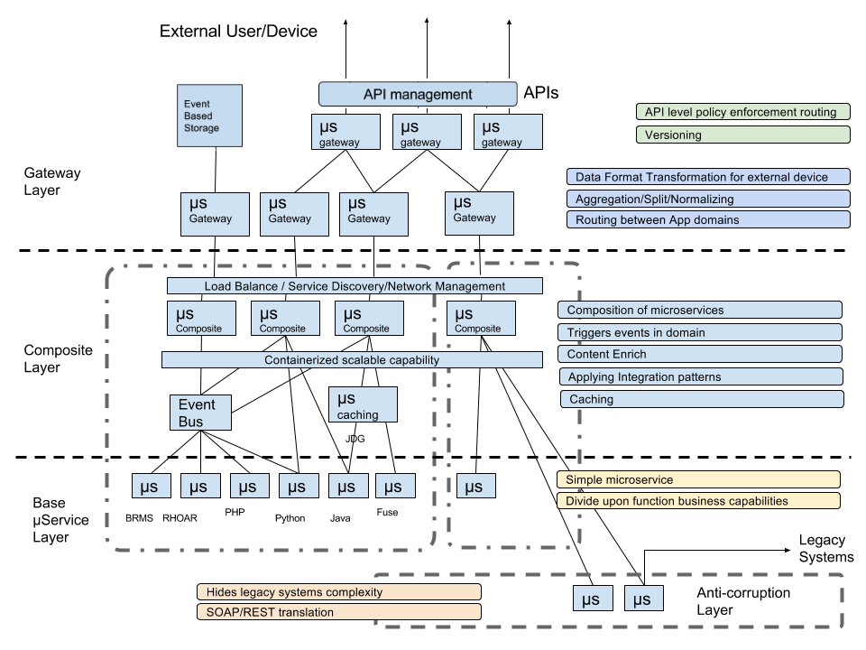

---

# ■ Service Mesh의 종류

[Service Mesh Tech.]


- Service Mesh는 현재 크게 세가지 유형으로 구분할 수 있다.

1) PaaS(Platform as a Service)의 일부로 서비스 코드에 포함되는 유형 `Mesh-Native Code`
: Microsoft Azure Service `fabric`, lagom, SENECA 등이 이 유형에 해당되며, 프레임워크 기반의 프로그래밍 모델이기 때문에, 서비스메쉬를 구현하는데에 특화된 코드가 필요하다. 

2) 라이브러리로 구현되어 API 호출을 통해 Service Mesh에 결합되는 유형 `Mesh Aware Code`
: Spring Cloud, `Netflix OSS`(Ribbon/Hystrix/Eureka/Archaius), finagle 등이 이 유형에 해당되며, framework library를 사용하는 형태. 이중 Netfilix의 Prana는 sidecar 형태로 동작하며 서비스 메시를 이해하고 코드를 작성해야 한다.

3) Side Car Proxy를 이용하여 Service Mesh를 Microservice에 주입하는 유형  `Side Car Proxy`
: `Istio/Envoy`, Consul, Linkerd 등이 이 유형에 해당되며, Sidecar Proxy 형태로 동작하므로 Service Mesh와 무관하게 Code를 작성할 수 있다.
: 최근의 Service Mesh는 Sidecar Pattern이 recommended 되고 있는 추세

--> Netflix 계열 OSS를 사용하기 위해선 동작을 위한 Application Library를 사용해야만 했는데, Kubernetes와 Service Mesh를 이용한 Microservice 관리(Istio/Envoy)시 소스코드 관리나 기존 정책을 바꿀 필요가 없다.

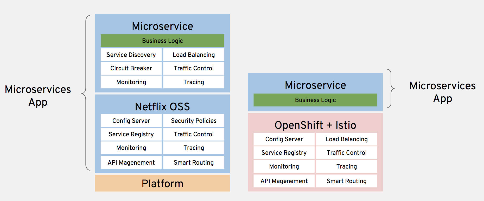


### Sidecar Pattern

- 모든 응용 program container에 추가로 sidecar container가 배포된다. Sidecar는 서비스에 들어오거나 나가는 모든 네트워크 트래픽을 처리하게 된다.
- business logic이 포함된 실제 service와 sidecar가 병렬로 구성되어, 서비스 호출에서 서비스가 직접 서비스를 호출하는 것이 아니라 proxy를 통해서 호출하게 된다.
- 대규모 MSA 환경이라고 하여도 개발자가 별도의 작업 없이 서비스의 연결 뿐만 아니라, 로깅, 모니터링, 보안, 트래픽 제어와 같은 다양한 이점을 누릴 수 있다.

[Sidecar Pattern]


---

# ■ Netflix OSS (Hystrix/Ribbon/Eureka/Archaius) [](https://github.com/Netflix)

Library로 구현되어 API 호출을 통해 Service Mesh에 결합되는 `Mesh Aware Code` 유형에 대한 실습을 진행해 본다.

  - microservice #1 : `displays`, port `8081` 
  - microservice #2 : `products`, port `8082`
  - Eureka Server : `eureka-server`, port `8761` (http://localhost:8761)
  - Zuul Server : `zuul`, port `8765`

## ■ Hystrix Dashboard

- Hystrix Dashboard는 앞의 Hystrix 설정에 따른 `Circuit Breaker`의 상태를 모니터링 할 수 있는 dashboard를 제공해주는 라이브러리이다. 사실 라이브러리라기 보다는 솔루션에 가깝다고 할 정도로 간단한 설정으로 실행할 수 있다.
- Client 요청은 많은 traffic과 다양한 형태(예상하지 못한 형태)의 요청으로 경고없이 운영 이슈 발생 상황에 신속히 대응할 수 있는 시스템 zuul을 개발
- zuul은 이런한 문제를 신속하고, 동적으로 해결하기 위해서 groovy 언어로 작성된 다양한 형태의 Filter를 실행한다.
- Filter에 기능을 정의하고, 이슈사항에 발생시 적절한 filter을 추가함으로써 이슈사항을 대비할 수 있다.

### Netflix Filter 기능

- Authentication and Security : 클라이언트 요청시, 각 리소스에 대한 인증 요구 사항을 식별하고 이를 만족시키지 않는 요청은 거부
- Insights and Monitoring : 의미있는 데이터 및 통계 제공
- Dynamic Routing : 필요에 따라 요청을 다른 클러스터로 동적으로 라우팅
- Stress Testing : 성능 측정을 위해 점차적으로 클러스터 트래픽을 증가
- Load Shedding : 각 유형의 요청에 대해 용량을 할당하고, 초과하는 요청은 제한
- Static Response handling : 클러스터에서 오는 응답을 대신하여 API GATEWAY에서 응답 처리

[Zuul Core Architecture]

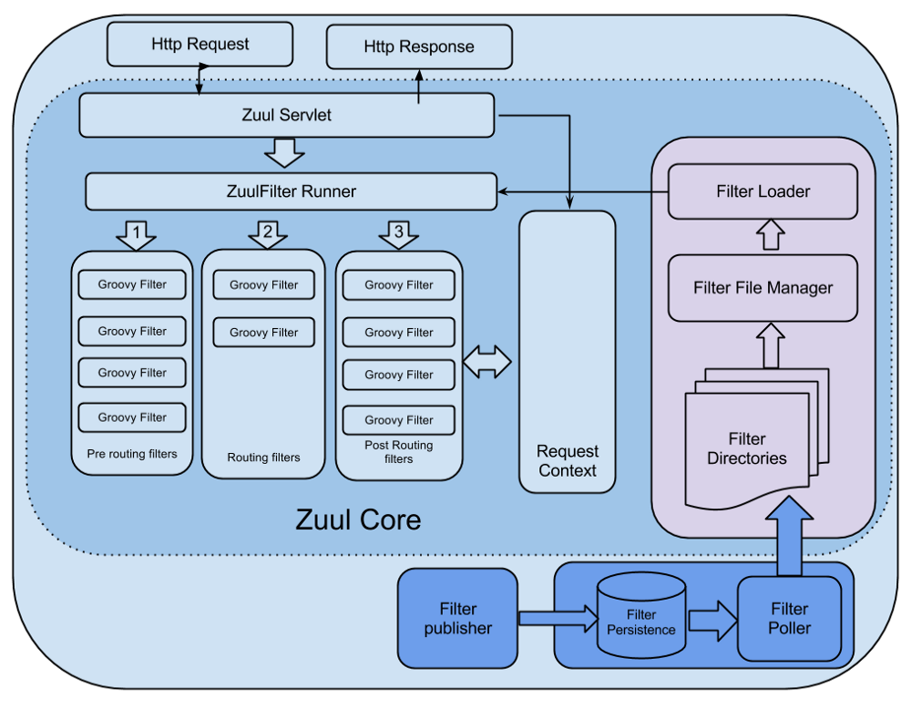

### Spring Cloud Zuul (Intelligent Routing)

- Zuul-Core의 ZuulServlet을 그대로 사용하여, 아래 그림과 같이 Spring MVC 위에서 동작하기 위해 몇 가지를 추가

[Zuul Core]

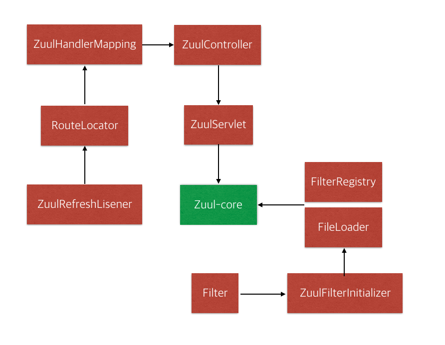

[Spring Cloud Zuul]  [](http://cloud.spring.io/spring-cloud-netflix/spring-cloud-netflix.html)

- `RouteLocator`은 url path에 대한 routing을 지정한다. 요청이 들어오면 url path로 어떻게 routing 할 것인가를 정의하고 있다.
- `ZuulHandlerMapping`은 org.springframework.web.servlet.handler.AbstractUrlHandlerMapping을 상속받고, RouteLocator에 정의된 url path에 zuulController를 매핑한다. RouteLocator에 정의된 path의 요청이 들어오면 zuulController를 호출하게 된다.
- `ZuulController`은 org.springframework.web.servlet.mvc.ServletWrappingController를 상속받으며, ZuulServlet을 주입시킨다. 그래서 ZuulController로 들어온 모든 요청은 ZuulServlet으로 처리한다.
- `ZuulFilterInitializer`는 filter Map에 정의된 filter를 FilterRegistry에 등록하고, FilterLoader로 로딩한다.


### Zuul의 build.gradle에 dependency 추가

```bash
compile('org.springframework.cloud:spring-cloud-starter-netflix-hystrix-dashboard')
compile('org.springframework.boot:spring-boot-starter-actuator')
```

### Zuul의 application.yml에 management 추가

```bash
spring:
  application:
    name: zuul

server:
  port: 8765

management:
  security:
    enabled: false
  endpoints:
    web:
      exposure:
        include: hystrix.stream
      base-path: /
```

- Spring Boot Project에 Artifact ID Spring-Cloud-Starter-Zuul를 추가하고 Main Class에 `@EnableZuulProxy`또는 `@EnableZuulServer`를 명시해주면 Zuul 서버가 구축된다.

### ZuulApplication.java에 Annotation 추가

```java
@EnableZuulProxy
@EnableDiscoveryClient
@SpringBootApplication
@EnableHystrixDashboard
@EnableTurbine

public class ZuulApplication {

    public static void main(String[] args) {
        SpringApplication.run(ZuulApplication.class, args);
    }
}
```

### Hystrix Dashboard Connction

[Hystrix Dashboard]


[Hystrix Stream]


### Isolation Starategy

- 격리 전략이란 일종의 Bulkhead Pattern이며, 각 서비스에 대한 dependency을 격리하고 동시 접근을 제한한다.
- 아래 그림에서 빨간색으로 표기된 상자는 특정 서비스의 호출이 지연되고 있다는 의미이며, 나머지 서비스에는 영향을 주지 않고 있다. 또한, 동시 접근 제한을 서비스별로 다르게 설정하고 있다.


- Isolation의 방법으로는 두 가지가 있다.
  1. `Thread & Thread Pools` [](https://github.com/Netflix/Hystrix/wiki/How-it-Works#threads--thread-pools)
    - 서비스 호출이 별도의 thread에서 수행된다. 이렇게 하면 네트워크상의 timeout 위에 thread timeout을 둘 수 있다.
    - 하지만 별도의 thread를 사용하는 만큼 비용이 드는데 여기서는 이를 가리켜 연산 오버헤드(Computational Overhead)라고 표현한다.
    - HystrixCommand를 사용할 때는 Thread isolation을 권장하고 있다.
  2. `Semaphore`
    - 서비스 호출을 위해 별도의 thread를 만들지 않는다. 단지 각 서비스에 대한 동시 호출 수를 제한할 뿐이다.


```bash
zuul:
  routes:
    product:
      path: /products/**
      serviceId: product
      stripPrefix: false
    display:
      path: /displays/**
      serviceId: display
      stripPrefix: false

  ribbon-isolation-strategy: thread <- "이번 실습에서는 Thread 방식을 사용한다."
  thread-pool:
    use-separate-thread-pools: true
    thread-pool-key-prefix: zuul-
...(중략)...
hystrix:
  command:
    default:
      execution:
        isolation:
          thread:
            timeoutInMilliseconds: 1000
    product:
      execution:
        isolation:
          thread:
            timeoutInMilliseconds: 10000 <- "Thread에 대한 timeout을 설정한다."
  threadpool:
    zuul-product:
      coreSize: 30
      maximumSize: 100
      allowMaximumSizeToDivergeFromCoreSize: true
    zuul-display:
      coreSize: 30
      maximumSize: 100
      allowMaximumSizeToDivergeFromCoreSize: true
```

---

## Zipkin

- Zipkin으로 추적할 수 있는 분산 트렌젝션은 HTTP를 기본으로 지원하고, 이외에도 많이 사용되는 리모트 프로토콜인 gRPC를 함께 지원한다.
- Zipkin 클라이언트 SDK는 [](https://zipkin.io/pages/existing_instrumentations)에 있는데, Zipkin에서 공식적으로 지원하는 라이브러는 아래와 같이 C#, Go, Java, Javascript,Ruby,Scala 등이 있다.
- Zipkin 라이브러리는 수집된 트렌젝션 정보를 zipkin 서버의 collector 모듈로 전송한다. 이 때 다양한 프로토콜을 사용할 수 있는데, 일반적으로 HTTP를 사용하고, 시스템의 규모가 클 경우에는 Kafka Queue를 넣어서 Kafka Protocol로 전송이 가능하다.
- Zipkin Client SDK에 의해서 전송된 정보는 Storage(In-Memory, MySQL, Cassandra, Elastic Serch)에 저장할 수 있다.
- 이렇게 수집된 정보는 Dashboard를 이용하여 시각화가 가능하다. Zipkin Server의 dashboard를 사용할 수 있고, Elastic Search 백앤드를 이용한 경우에는 Kibana를 이용하여 시각화가 가능하다.


[Zipkin Architecture]

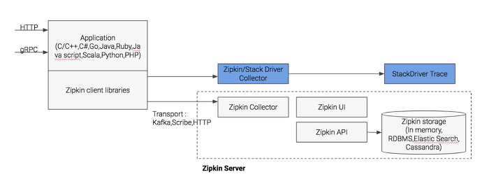


# ■ Spring Sleuth를 이용한 Zipkin 연동

- Application에서 Distributed Log Trace를 해보자.
- Spring Boot application을 Zipkin과 연동하기 위해서는 `Sleuth`라는 Library를 사용하면 된다.
- Java application에서 Trace 정보와 Span 정보를 넘길 때, 여러 class의 method들을 거쳐서 transaction이 완성될때, Trace 정보와 Span 정보 Context가 유지가 되어야 하는데, thread마다 할당되는 thread의 일종의 전역변수인 Thread Local 변수에 이 Trace와 Span Context 정보를 저장하여 유지한다.
- 분산 트렌젝션은 HTTP나 gRPC로 들어오기 때문에, Spring Sleuth는 HTTP request가 들어오는 시점과 HTTP request가 다른 서비스로 나가는 부분을 wrapping하여 Trace와 Span Context를 전달한다.
- 아래 그림과 같이 HTTP로 들어오는 요청의 경우에는 Servlet filter를 이용하여, Trace Id와 Span Id를 받고 (만약에 이 서비스가 맨 처음 호출되는 서비스라서 Trace Id와 Span Id가 없을 경우에는 이를 생성한다.)
- 다른 서비스로 호출을 할 경우, `RestTemplate`을 wrapping하여, Trace Id와 Span Id와 같은 Context 정보를 보낸다.

[Spring Sleuth]


### MicroService의 build.gradle에 Zipkin 및 Sleuth dependency 추가

```bash
compile('org.springframework.cloud:spring-cloud-starter-zipkin')
compile('org.springframework.cloud:spring-cloud-starter-sleuth')
```

### MicroService의 application.yml에 zipkin 및 sample 추가

```bash
spring:
  application:
    name: display

  zipkin:
    baseUrl: http://127.0.0.1:9411/
    sleuth:
      enabled: true
      sampler:
        probability: 1.0

  sample:
    zipkin:
      enabled: true
```

### MicroService의 Controller에 Annotation 추가

```java
public class DisplayController {
    @Autowired
    RestTemplate restTemplate;
    @Bean
    public RestTemplate getRestTemplate() {
        return new RestTemplate();
    }
    @Bean
    public Sampler alwaysSampler() {
        return Sampler.ALWAYS_SAMPLE;
    }
```

- alwaysSampler() 정의를 통해 Tracing Transaction Rate를 결정 가능

### Zipkin 서버 구동

- jar 파일을 다운 받은 후에, java -jar로 서버를 구동하는게 간편하다.
※ 유의사항 : zipkin 서버를 통해서 HTTP로 Trace Log를 받을 때, 별도의 보안이나 인증 메커니즘이 없기 때문에 zipkin 서버는 반드시 방화벽 안에 놓고 서비스 서버로부터만 HTTP 호출을 받을 수 있도록 해야 한다.

```bash
> wget -O zipkin.jar   <-- Download
> java -jar zipkin.jar <-- Server 구동
```

### Zipkin을 통한 결과 확인

- 서비스 구동
- `http://localhost:9411` Zipkin Server 접속
- Find Traces를 통한 개별 Transaction 확인

[Trace Result]


---

# ■ Google Cloud Stack Driver Trace 연동

- 자체 SDK를 이용하여 transaction을 추적하는 것도 가능하며, Zipkin client로 부터 log를 수집할 수 있다.
- 개발 server는 Zipkin을 사용하고, backend에는 복잡한 Zipkin 서버 대신 Stack driver trace를 사용하는 방법으로 Zipkin 서버 대신 Zipkin/stack driver collector라는 server를 띄우면(addr/port 변경), 이 server가 Stackdriver로 log를 저장하고 시각화 해준다.
- Google Cloud뿐만 아니라, local 환경, AWS, Azure, On Prem 등 다양한 환경에 설치가 가능하여 모든 애플리케이션 서비스를 통합해서 Stack driver로 trace가 가능하다.

- Service별 build.gradle에 dependency 정의

```java
// https://mvnrepository.com/artifact/com.google.cloud.trace.adapters.zipkin/collector
compile('com.google.cloud.trace.adapters.zipkin:collector:0.6.0') // To use StackDriver
```

### Install Zipkin/stack driver collector [](https://cloud.google.com/trace/docs/zipkin)

- Docker Image 또는 java jar 파일을 download하여 사용한다.
- Google Cloud VM이나 Docker로 실행할 때는 상관 없지만, google cloud 밖에서 Zipkin Stackdriver collector를 실행할 때는 추가 인증 정보를 설정해야 한다.
- Stack driver collector가 Stackdriver server(google cloud)로 log를 전달하기 위해서는 아무 log나 받으면 안되고 추가 인증된 log만 받아야 하는데 google cloud에서는 application 인증을 위해서 Service Account라는 JSON 파일을 사용한다. [](https://medium.com/google-cloud/distributed-tracing-spring-boot-microservices-with-stackdriver-trace-7fe42c6de3f3)
- Service Account 파일이 생성되면, 아래와 같이 `GOOGLE_APPLICATION_CREDENTAILS` 환경 변수에 Service account 파일의 경로를 지정하고 google cloud의 어느 project에 있는 Stack Driver와 연결할지를 `PROJECT_ID` 환경 변수에 Project명을 지정해주면 된다.

```bash
export GOOGLE_APPLICATION_CREDENTIALS="c:/zipkin-proxy-dc1792cd9893.json"
export PROJECT_ID="zipkin-proxy"
```

- 환경변수 설정이 끝나면 `java -jar collector-0.6.0.jar` 명령으로 collector를 실행한다. (port: 9411)
- GCP내 Stackdriver > Trace > Trace List을 통해 세부정보 확인

[Result]


---

### API Composition의 Response Time 감소 방안

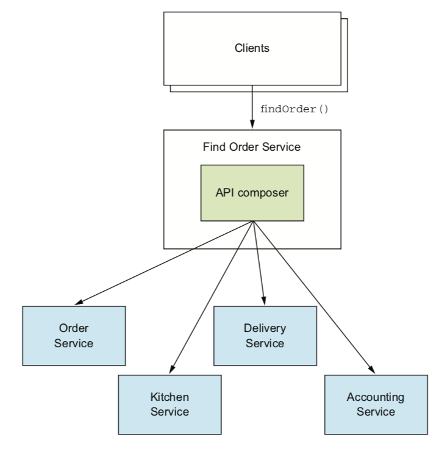

- FindOrderService에서 주문 상세 조립물을 만들기 위해 API를 순차적으로 호출한다면 API가 많으면 많을수록 응답 시간이 길어질 것이다. 예를 들어 OrderService, KitchenService, AccountingService는 각 1초가 걸렸지만 DeliveryService에서 5초가 걸렸다면 결과적으로 응답 시간은 8초가 걸린다.
- 반면 동시에 API를 호출하여 데이터를 조립한다면 상대적으로 응답 시간을 줄일 수 있다.


- Java에서는 동시성을 Thread로 구현한다. Java 5에 도입된 `Concurrency API`(java.util.concurrent 패키지)를 사용하여 여러 Thread에 API 호출하는 작업을 할당하여 동시에 실행하는 것을 구현할 수 있다.

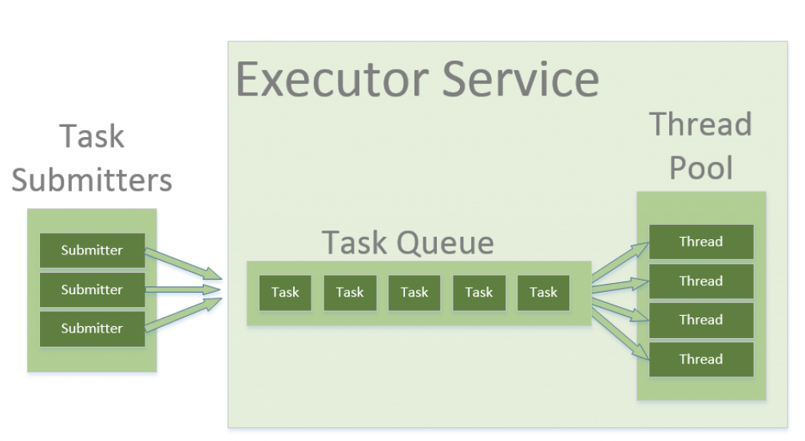

- Java 8에서 Concurrency API 향상으로 도입된 것이 `CompletableFuture`이다. CompletableFuture는 비동기 작업들을 함께 묶을 수 있으며 더 나아가 단계로 구성할 수 있다.
- 어떤 API는 중요한 정보가 아니라서 정해진 시간 이내에 응답이 오지 않으면 무시하고 결과를 전달할 필요가 있다.
- Java 8의 CompletableFuture는 명시적으로 timeout을 지원하지 않는다. 다행히도 `Java 9`부터 CompletableFuture는 or `Timeou` 메소드를 지원한다.

---

# ■ Swagger 연동
Usage of Swagger 2.0 in Spring Boot Applications to document APIs

- Source Code내에서 annotation을 통해 직접 API를 문서화할 수 있다.

### MicroService의 build.gradle에 Swagger dependency 추가

```bash
compile('io.springfox:springfox-swagger2:2.9.2')
compile('io.springfox:springfox-swagger-ui:2.9.2')
```

### MicroService의 Application에 Annotation 및 @Bean 추가

```java
@EnableSwagger2
...
@Bean
public Docket newsApi() {
    return new Docket(DocumentationType.SWAGGER_2)
        .groupName("display")
        .apiInfo(apiInfo())
        .select()
        .build();
}
 
private ApiInfo apiInfo() {
    return new ApiInfoBuilder()
        .title("Micro Service Architecture with Swagger")
        .description("Micro Service Architecture with Swagger")
        .license("Apache License Version 2.0")
        .version("2.0")
        .build();
    }
...

```

### MicroService의 Controller에 @ApiResponses 추가

```java
@ApiResponses(value = { 
  @ApiResponse(code = 200, message = "Success", response = DisplayApplication.class),
  @ApiResponse(code = 401, message = "Unauthorized"),
  @ApiResponse(code = 403, message = "Forbidden"),
  @ApiResponse(code = 404, message = "Not Found"),
  @ApiResponse(code = 500, message = "Failure")}) 
```

### Swagegr Run

- http://localhost:8081/swagger-ui.html#/

[Result]


---

# ■ Monolithic Acrchitecture에서 MSA로의 Migration 방법론

- MSA는 모든 Application에 적용할 수 있는 것은 아니다.
- MSA로 이동해야 한다면, 기존 Monolith에서 감수해 내야만 하는 것들을 결정해야 한다.
- 매우 드문 경우에만 Monolith의 모듈 그대로를 분리하여 MSA화 할 수 있다. 그 외의 경우에는 기존 프로세스를 유지하지 못한다.(코드 레벨까지 수정 혹은 재개발이 필요하다.)
- MSA가 비즈니스 확장성 및 생산성에 큰 이점이 있는 것은 사실이지만, 어떤 경우에는 Monolith를 그대로 유지하여 개발하고, 운영하는 것이 더 큰 business value를 가져다 주기도 한다.
- Monolith는 단일 객체 그 자체이기 때문에, 해당 architecture에 속해 있는 데이터 모델 및 데이터베이스를 변경하는 것은 매우 어렵거나 거의 불가능에 가깝다. 이를 위해서는 데이터에 대한 Refactoring이 필요하다.

### Microservice Decomposition

- 코드의 API화나 Integration 등에 대한 이야기 보다는 종속된 데이터 관계를 어떻게 분리시킬 것인지, 분리된 데이터 관계로 인한 모듈화가 중요하다.
  - `Module에 대한 식별` : 기존 모듈을 유지하거나, 새로운 모듈 작성, 어떤 기능(모듈)을 분리하고 싶은지, 해당 서비스가 어떤 테이블에 연관되어 있는지에 대해 판단한 다음 그 곳에서 부터 변화를 시작해야 한다.
  - `DB 재정의` : 각각 모듈에 해당하는 Database table 분리, 서비스로 포장, dependencies 업데이트. 각 모듈의 독립성을 유지하기 위해서는 반드시 데이터가 분리되어야 한다.
  - `Code Update` : 새로운 서비스를 호출하기 위해 DB 테이블에 직접 호출했던 코드 업데이트
  - 더 이상 모듈화 단계를 반복할 수 없을 때까지 이 방법을 지속적으로 강화 및 반복한다. but,
    - 현존하는 많은 수의 monolith가 위와 같은 방법으로 깔끔한 모듈화가 어렵다.
    - 테이블 간의 정규화, 엔티티 결합, 무결정 제약 조건 등을 유지하기 까다롭다.
    - Monolith에 복잡한 Query 코드를 작성했을 때, 어떤 테이블을 어떻게 사용했는지 이해하기 힘들 수 있다.
    - 단순하게 모듈을 쪼개는 방식이 아닌 매우 까다롭고 비용이 많이 드는 migration이 있을 수 있다.
    - 모듈화를 진행하다 보면, 오히려 쪼개지 않는 쪽에 이점이 많은 지점이 생길 수 있다.


[Migration]

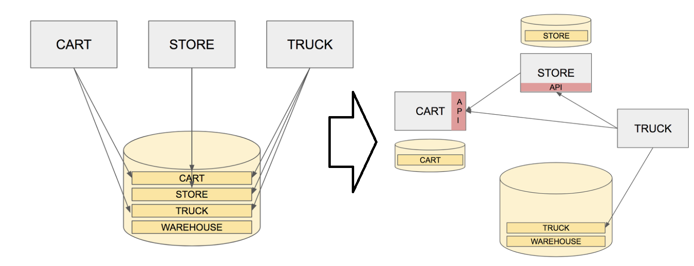


### Microservice Migration Steps

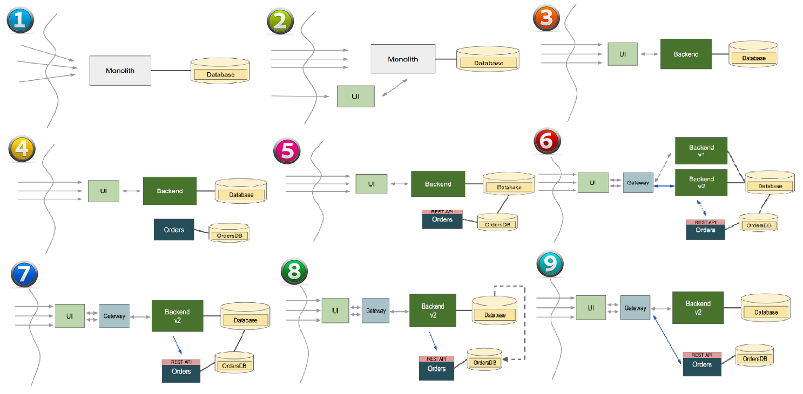


1. `Monolith 판단시 고려사항`
  - Monolithic code와 DB는 변화하기 매우 어렵다.
  - MSA로의 변경은 팀간의 높은 수준의 협업과 커뮤니케이션이 필요하다.
  - 우리는 반복적인 분석을 통해 수 없이 많은 테스트를 실시해야 한다. 비즈니스는 안정성이 필수이기 때문이다.
  - 완벽한 자동화를 이용하여 새로운 프로세스를 배포해야 한다. 

2. `UI 추출시 고려사항`
  - 이 단계에서 Monolithic Application을 수정하면 안된다. 단순히 Monolith에 포함되어있는 UI를 `Copy-Paste로 복사를 하여 분리`시켜야 한다.
  - 작업을 수행하기 전, UI와 Monolith 사이에 적절한 `API Interface 설계`가 되어 있어야 한다.
  - Ingress 구간이 두 채널이 되기 때문에, `보안에 대한 고려`도 필요하다.
  - UI와 Monolith 두 구간으로의 트래픽 분산을 위한 `Platform 설계`가 돼있어야 한다. 또한 Canary, Blue-green, Rolling Deployment 정책을 수행하기 위한 프로세스도 존재해야 한다. 

3. `UI를 Monolith에서 분리시 고려사항`
  - UI 모듈을 Monolith에서 완전히 제거하는 작업이다.
  - 이 작업을 수행하려면 Monolith에 대한 최소한의 변경이 필요하다.
  - Routing/Shaping 방식을 사용하여 다운타임 없이 변화를 수행해야 한다.

4. `신규 서비스 도입시 고려사항`
  - 신규 서비스는 기존 Backend와의 API 디자인 및 Boundary에 대한 우선적인 설계가 될 것이다.
  - 이 서비스는 Backend에서 분리된 것이 아니라, 새롭게 작성된 기능이다.
  - API 설계를 결정한 후에는, 간단한 Scaffolding 혹은 Place holder를 구현할 것이다.
  - 신규 서비스는 자체 데이터 베이스를 가지고 있다.
  - 아직 이 단계에서는 서비스에 트래픽이 접근하지 않는다.

5. `신규 서비스와 API 통합시 고려사항`
  - 신규 서비스는 Monolith의 데이터 모델과 긴밀하게 결합된 모델을 가지고 있다.
  - 실 상황에서 Monolith는 데이터를 얻기 위한 API가 설계되어 있지 않을 가능성이 크다.
  - Read-only query를 위해 임시적으로 Backend DB에 direct로 접근할 수 있다.
  - Monolith의 DB가 수정되는 일은 거의 없다.

6. `신규 서비스의 Dark Launch시 고려사항`
  - Code path에 신규 서비스를 적용하면 많은 이슈가 발생할 수 있다.
  - 신규 서비스의 영향도를 체크하고 모니터링 해야한다.
  - 트래픽 제어를 위한 `gateway platform`에 대한 구성이 필요하다.
  - 이 게이트웨이 플랫폼을 이용하여 특정 사람 혹은 집단의 트래픽을 새로운 Backend 서비스로 연결해야 한다.

7. `신규 서비스로 Canary/Rolling 배포시 고려사항`
  - 바로 이 ‘cohort group’을 식별하고 새로운 Microservice에 실시간 트랜잭션 트래픽을 보낼 수 있어야 한다.
  - 트랜잭션이 여전히 두 코드 경로로 진행되는 일정한 기간이 있기 때문에, 여전히 Monolith에 직접 데이터베이스 연결이 필요하다.
  - 모든 트래픽을 새로운 버전인 Microservice로 이동 한 후에 그 전 기능을 제거해야 한다.
  - 라이브 서비스를 새로운 v2 서비스로 보내면 이전 버전으로 Rollback할 때 이슈가 발생할 수 있다. v1과 v2를 Load-balancing 방식으로 계속 트래픽을 공유하면 안된다.

8. `Offline Data ETL/Migration시 고려사항`
  - Monolith의 데이터와 Microservice 데이터가 공유 가능한 데이터인지 확인해야 하며, 공유 및 변경이 가능하다면 데이터 소유에 대한 이슈를 해결해야 한다.

9. `Datastore와 연결 해제 및 Decouple시 고려사항`
  - 신규 서비스의 API Interface를 backend direct로 연결된 것이 아닌 gateway 모듈로 연결하여 완전한 De-coupling 구조로 만든다.

---

# ■ Istio [](https://istio.io/docs/concepts/what-is-istio/)

- Istio를 사용하면 서비스 코드의 코드 변경 없이 로드 밸런싱, 서비스 간 인증, 모니터링 등을 통해 배포된 서비스의 네트워크를 쉽게 생성할 수 있다.
- Istio는 서비스 네트워크 전체에 걸쳐 다음과 같은 다양한 주요 기능을 제공한다.
  - `Traffic Management` : Istio의 쉬운 규칙 구성 및 트래픽 라우팅을 통해 서비스 간의 트래픽 및 API호출 흐름을 제어할 수 있다. 또한 circuit breakers, timeout 및 재시도와 같은 서비스 레벨 속성의 구성을 단순화하고 A4B test, canary rollout, 백분율 기반 트래픽 분할과 같은 중요한 작업을 쉽게 설정할 수 있다.

  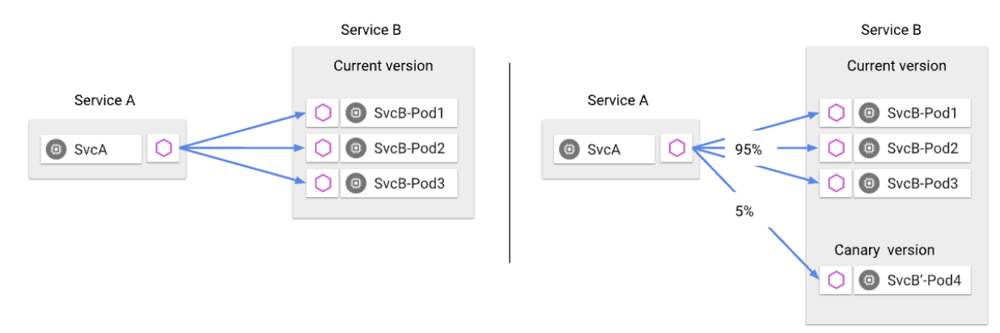

  - `Security` : 기본 보안 통신 채널을 제공하고 서비스 통신의 인증, 권한 부여 및 암호화를 규모에 맞게 관리할 수 있다. 기본적으로 envoy를 통해서 통신하는 모든 트래픽을 자동으로 TLS를 이용해서 암호화한다. 즉 서비스간의 통신이 디폴트로 암호화 된다.

  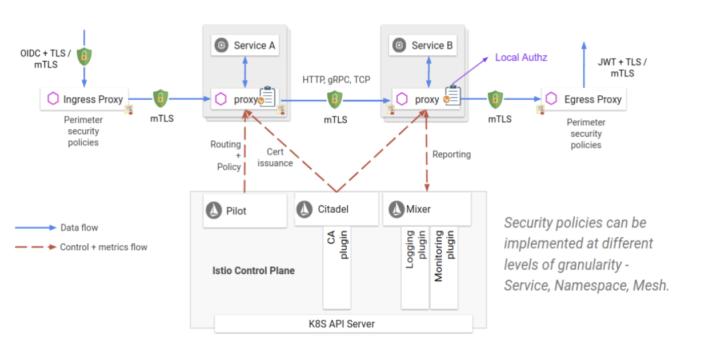  

  - `Policies` : Istio를 사용하면 다음과 같은 규칙을 런타임에 적용하도록 응용 프로그램에 대한 사용자 지정 정책을 구성할 수 있다.
    - 서비스에 대한 트래픽을 동적으로 제한하는 속도 제한
    - 서비스 액세스 제한을 위한 부정, 화이트 리스트 및 블랙 리스트
    - 헤더 다시 쓰기 및 리디렉션

  - `Observability` : 강력한 추적, 모니터링 및 로깅 기능을 통해 서비스와 서비스 간의 종속성을 관리하며, 트래픽 간의 특성 및 흐름을 파악하여 이슈를 신속하게 파악할 수 있다.
  - `Platform Support` : Istio는 Cloud, On-premise, Kubernetes, Mesos 등 다양한 기반 환경에서 실행할 수 있도록 설계되었다. 현재는 Kubernetes에 중점을 두고 있지만, 곧 다른 환경을 지원하기 위해 커뮤니티가 진행되고 있다.
  - `Policy Enforcement` : 서비스 간 상호 작용에 대해 access, role 등의 정책을 설정하여 리소스가 각 서비스에게 공정하게 분배되도록 제어한다. 이 정책 변경에 대한 부분은 application 소스를 직접 수정하는 것이 아니라 mesh로 제어가 된다.
  - `Integration and Customization` : 정책 집행이 가능한 영역을 확장하기 위하여 mesh의 연결에 대한 부분을 커스터마이징하여 ACLs, Logging, Monitoring, quotas, auditing 등의 기존 솔루션과 통합할 수 있다.

- Istio Service Mesh는 논리적으로 Data Plane과 Control Plane으로 나뉜다.
- `Data Plane`은 Microservice 사이의 모든 네트워크 통신을 조정하고, 제어하는 Kubernetes의 Application Pod에 Sidecar Container로 배치된 Envoy Proxy로 구성된다.
- `Control Plane`은 Pilot, Mixer, Istio-Auth로 구성되어 런타임에 정책을 시행 할뿐만 아니라 트래픽을 라우팅하기 위해 프록시를 관리 및 구성한다.


- `Envoy`
  - C++로 개발된 고성능 Proxy Sidecar로서 Service Mesh의 모든 서비스에 대한 Inbound/Outbound 트래픽을 처리한다.
  - Dynamic Service Discovery, Load Balancing, TLS Termination, HTTP/2 & gRPC Proxying, Circuit Breakers, Health Checks, %-based Traffic Split, Fault Injection, Rich Metrics 등의 기능을 포함한다.

  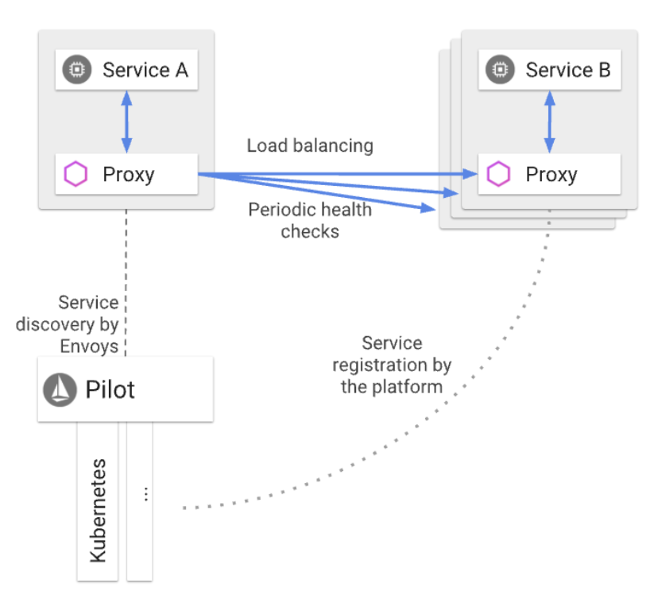

  - 동일한 Kubernetes Pod의 Application Service에 Sidecar로 배치된다. 이를 통해 Istio는 트래픽 동작에 대한 데이터를 attribute로 추출할 수 있고, Mixer에서 정책을 관리하는데 사용할 수 있으며, 모니터링 시스템(Prometheus, Grafana 등)에 보내져 전체 Mesh의 동작에 대한 정보를 관리할 수 있다.

- `Mixer`
  - Service Mesh 전체 영역에서 액세스 제어 및 사용 정책을 정의하고, Envoy Proxy 및 기타 서비스에서 데이터를 원격에서 수집하는 독립 모듈이다.
  - Request Level attribute를 추출하여 평가를 위해 Mixer로 데이터를 보낸다.
  - Plugin이 가능한 adaptor 구조로, 운영하는 인프라에 맞춰서 logging 및 monitoring system 변경이 가능하다. k8s에서 많이 사용되는 Heapster나 Prometheus에서부터 GCP의 StackDriver, 전문 모니터링 서비스인 Datadog등으로 저장이 가능하다.

- `Pilot`
  - Envoy Sidecar에 대한 서비스 검색, 지능형 라우팅 (예 : A/B 테스트, Canary 배치 등) 및 Resiliency (timeout, retries, circuit breakers 등)을 위한 트래픽 관리 기능을 제공한다. 
  - 특정 트래픽 정책을 Envoy Sidecar Container로 전달하여 라우팅 규칙들을 적용시켜준다.
  - Pilot은 플랫폼에 종속되지 않고, Envoy Data Plane을 준수하는 모든 Sidecar에 표준 format으로 통합시킨다.

- `Istio-Auth`
  - Mesh를 관리하기 위한 ID 및 서비스 Authentication을 위해 TLS를 사용한 Service-To-Service Enduser 인증을 제공한다.
  - Service Mesh에서 암호화되지 않은 트래픽을 전송하는 데 사용할 수 있으며, 운영자는 네트워크 컨트롤 대신 Service ID를 기반으로 정책을 시행할 수 있다.

## Getting Started

- Istio를 설치하기 위해서는 Kubernetes 기반의 Platform이 준비되어야 한다. [`Openshift 3.7(Kubernetes 1.7)`]

### Release Download [](https://github.com/istio/istio/releases/tag/1.4.4)

- 현재 Istio의 최신 버전은 `1.4.4` 이다.

```bash
$ curl -L https://istio.io/downloadIstio | sh -
$ cd istio-1.4.4
$ export PATH=$PWD/bin:$PATH
```

## Service Tools

- `Prometheus` : System 모니터링 및 Alert을 위한 Toolkit으로, CNCF(Cloud Native Computing Foundation)의 2번째 호스팅 프로젝트로 선정될 정도로 활발한 오픈소스 모니터링 프로젝트이다. (첫번째는 Kubernetes). 다만, Scale-out이 안되는 구조라 Pod의 Size(CPU/MEM/Disk)를 늘려야 한다.
- `Grafana` : 등록되어 있는 서비스(Application)과 상호작용하는 쿼리, 통신, 상태 등을 시각적으로 보기 좋게 나열해주는 Metrics Visualization 도구이다.
- `Jaeger Tracing` : 등록되어 있는 서비스들의 시계열 데이터를 모아 Tracking을 제공해주는 toolkit으로 troubleshooting, Latency issue 등을 tracing할 수 있는 MSA 환경에서의 분산 트레이싱 도구이다.
- `Kiali` (https://www.kiali.io/) : Istio에 의해서 수집된 각종 지표를 기반으로, 서비스간의 관계를 시각화하여 나타낼 수 있다.

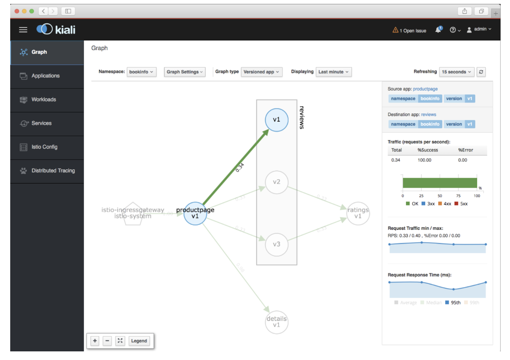

- `Servicegraph` : Mesh 안에서 서비스들의 그래프를 나타내주는 toolkit이다.


---

### Project Management using Trello

[Trello]

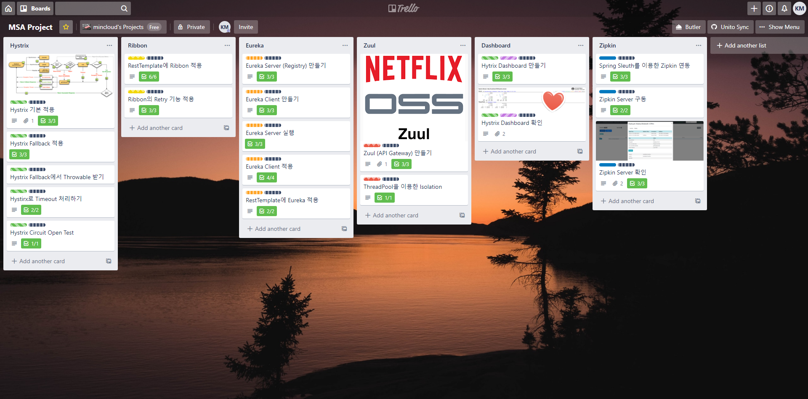