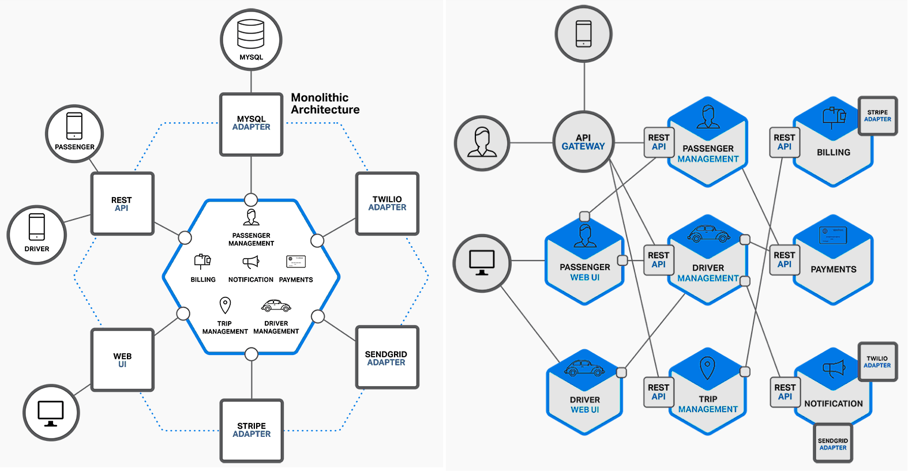
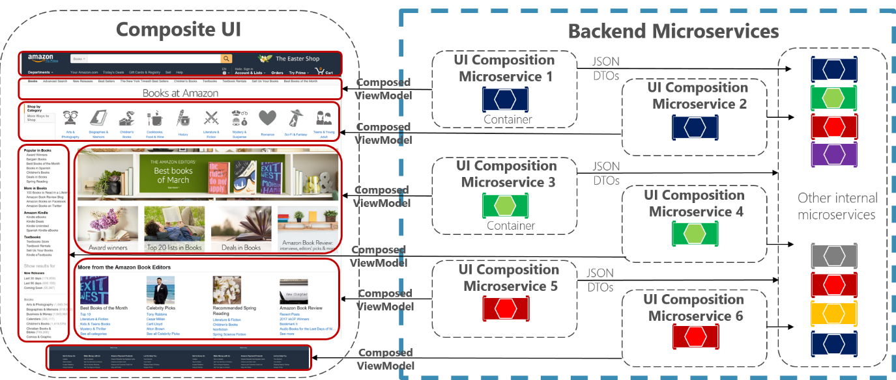
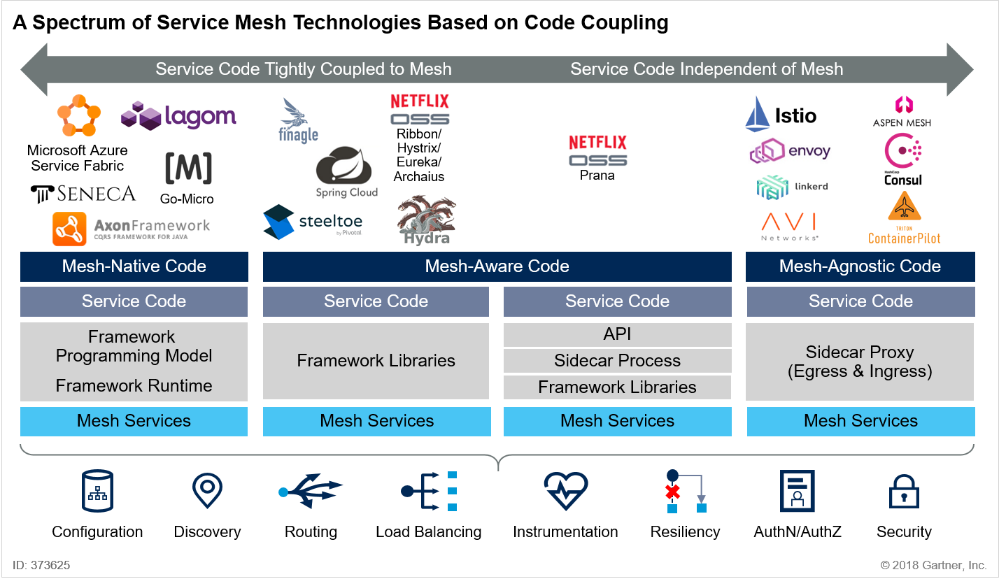
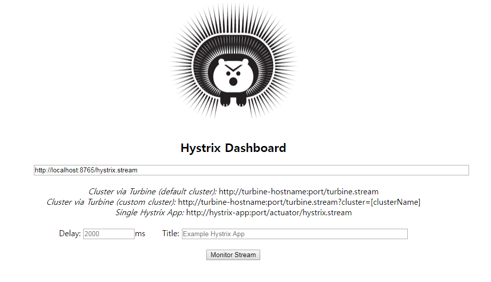
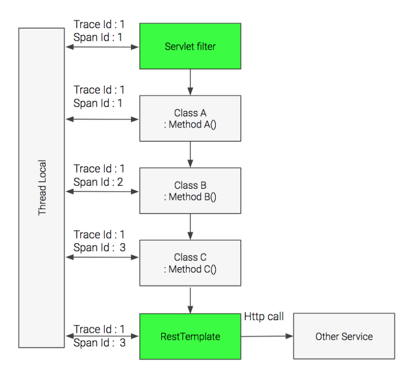
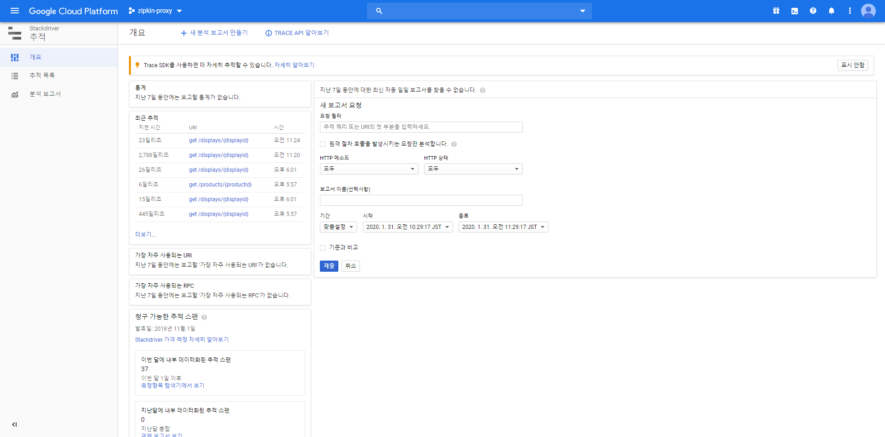
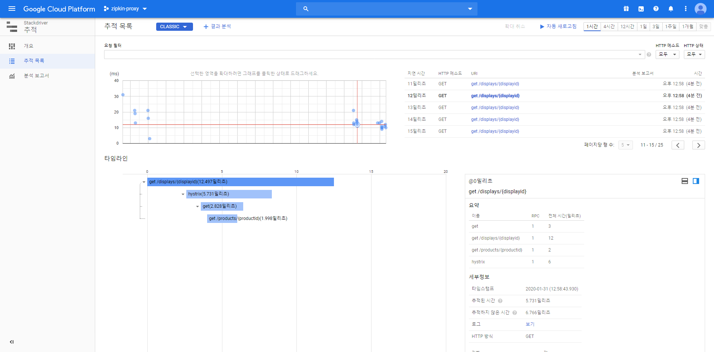
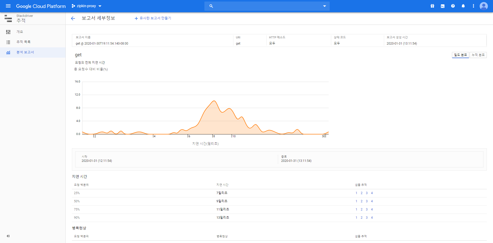

# SpringBoot-MSA-Workshop
[](https://gitter.im/MSA_miniProject/community)&nbsp;
[](https://spring.io/guides/gs/rest-service/)&nbsp;
&nbsp;

MSA Development Project with Spring Boot using Netflix OSS







# ■ MSA Components

- `Container Management` : 개별 service instanece에는 작동할 context가 필요한데 VM, Docker container 또는 조정된 process로 구현된 관리 container는 이러한 기능을 제공한다. instance 관리 및 조정을 제공하고 필요에 따라 개별 인스턴스의 lifecycle를 관리한다.

- `External Gateway` : 서비스에 대한 access를 관리하고 traffic 관리 및 보안 정책을 적용하여 microservice 환경을 보호한다. 외부 게이트웨이 기능은 종종 API 관리 제품을 사용하여 구현된다.

- `Service Mesh` : 서비스 간의 통신을 느슨하게 결합, 신뢰성 및 유연성을 유지하는 데 도움이되는 기능으로 구성되며, 이러한 기능을 통해 서비스 분리, 버전 관리 전략 지원 및 부하시 탄성 확장성 관리가 가능하다.
  - `Service Router` : 클라이언트 응용 프로그램에서 또는 마이크로 서비스 사이의 요청은 구성 및 정책에 따라 올바른 마이크로 서비스로 라우팅해야 한다.
  - `Load Balanceing` : 각 마이크로 서비스의 인스턴스는 확장 성을 지원하기 위해로드 밸런싱이 필요하며, 로드 밸런싱의 세밀성 및 구성은 각 서비스를 관리하는 팀에 의해 제어되야 한다.
  - `Service Discovery` : 서비스는 느슨하게 결합 된 방식으로 서비스 레지스트리를 사용하여 구현되며, 이 서비스 레지스트리에서 마이크로 서비스 소유자는 런타임에 다른 서비스가 필요로 하는 정보를 등록 및 구성하여 찾아서 호출 할 수 있다. 마이크로 서비스간에 존재할 종속성을 관리하는데 도움을 주며 환경 변화를 관리할 때 중요하다.
  - `Config. Store` : 서비스 인스턴스는 마이크로 서비스와 전체 환경과 관련된 구성을 공유해야 한다. 예를 들어, 환경에 배포된 마이크로 서비스에는 서비스 검색 레지스트리의 위치와 로그 이벤트를 내보내는 위치를 파악하는 방법이 필요한데 분산 특성으로 인해 분산 키-값 저장소를 사용하여 구현되는 경우가 많다.
  - `Identity Provider` : 서비스 인스턴스는 신뢰할 수 있는 ID를 사용하여 통신하며, 서비스 메시는 이러한 ID를 제공하고 유효성을 검사한다.

- `Service Image Repo` : 사용자 환경의 어딘가에는 빌드되고 테스트된 서비스의 불변 이미지를 저장하는 레지스트리가 있다. 이 저장소에 사용되는 기술은 사용하는 배포 단위에 따라 다른데 코드 저장소(동적으로 생성 된 서비스의 경우), Docker 이미지 레지스트리, 이진 아티팩트 저장소 또는 VM 이미지의 BLOB (Binary Large Object) 기반 저장소 일 수 있다.

- `Message Oriented Middleware` : 가장 간단한 MSA 구현은 HTTP와 같은 동기식 프로토콜 또는 gRPC 또는 Thrift와 같은 보다 효율적인 프로토콜을 사용하여 지속 가능할 수 있지만 대부분의 MSA는 이벤트 및 메시지 중심 패턴을 지원하기 위해 비동기 메시징 채널이 필요하다

- `Build/Test Automation` : MSA의 개발 민첩성 이점은 개발 출력 품질을 극대화하고 전달을 간소화하기 위해 개발주기에서 높은 수준의 빌드 및 테스트 자동화가 필요하다.

- `Deployment Automation` : 개발 민첩성 이점을 완전히 실현하려면 배포를 자동화 해야 한다. 외부 아키텍처 자체의 변경 자동화 (ex: 배포의 일부로 서비스 라우팅, 로드 균형 조정, 서비스 검색 및 서비스 구성 데이터 업데이트)를 지원해야 한다.

- `Platform Automation` : 마이크로 서비스의 런타임 확장성과 적응성 이점을 실현하려면 외부 아키텍처에 기본 플랫폼과 관련된 자동화 기능 지원이 포함 되어야 한다. 여기에는 VM 또는 컨테이너의 프로비저닝 및 각 마이크로 서비스의 실행 중인 인스턴스 관리가 포함된다.

- `Monitoring/Alert` : 분산 환경에서 문제가 발생할 때 모니터링 및 경고의 복잡성이 증가된다. 외부 아키텍처는 일관되고 효율적으로 이를 수행 할 수 있는 기능을 제공해야 한다.

- `Logging & Diagnotics` : 분산 환경에서 문제가 발생하면 근본 원인을 식별하고 격리하기가 어려울 수 있다. 분산된 프로세스의 추적을 포함하여 자세한 계측 및 진단 분석을 지원함으로써 외부 아키텍처는 마이크로 서비스 팀이 문제를 보다 신속하게 분류하고 해결할 수 있도록 지원한다.

- `Identity Provider` : 토큰 기반 서비스를 사용하여 인증 및 권한 부여를 외부화하는 것은 안전한 고객 대 서비스 및 서비스 대 서비스 상호 작용을 보장하는 것이 좋다.

[MSA Components]


---

# ■ MSA Layers [](https://developers.redhat.com/blog/author/weimeilin/)

- Microservice Architecture에 대해 4개의 독립된 Layer를 정의하여 각 Layer가 개별적으로 쉽게 변할 수 있다.
- `Gateway Layer` : 버전 관리와 같은 간단한 게이트웨이 라우팅 기능을 제공하여 다른 플랫폼의 장치를 처리한다.
  - APIs
    - Traffic throttle 처리에 필요한 모든 정책
    - API 보안
    - 올바른 버전으로의 라우팅
  - Combine
    - 데이터 정규화에 대한 유지
    - 클라이언트 형태에 따른 output type의 변형
    - Application Domain간의 연결

- `Composite layer` : 다수의 Microservice 구성을 처리하는 중요한 중간 Layer이다. 이 계층에서 데이터 처리에 대한 복잡한 라우팅을 수행하고 데이터를 split/aggregate하며 이벤트를 트리거하거나 단순히 전달함으로써 분할/집계된 결과를 다른 마이크로 서비스에 적용한다. 이 계층은 Client로 부터 Microservice의 복잡성을 숨긴다.
  - MSA 구현 : Microservice에서 사용할 수있는 API를 호출하고 필요에 따라 데이터를 변환하며 해당 내용을 기반으로 담당 Microservice로 데이터를 라우팅한다.
  - Event Trigger : 각 서비스간 느슨한 연결을 통해 Event를 유지해야 한다. 비동기 특성으로 인해 최상의 성능을 보장하는 형태를 구현한다. 여기서 이벤트 버스는 Message Broker일 필요는 없지만 모든 형태의 버스가 될 수 있다.
  - Caching : REST Architecture는 Caching이 필요하다. 복합 Layer는 비즈니스 연관성이 떨어지므로 캐싱 메커니즘을 적용하여 Stateless를 유지해야 한다.

- `Basic Layer` :  시스템의 기본 구성 요소를 포함한다. 데이터 검색 또는 비즈니스 로직 처리를 처리한다. 각각은 모듈은 모두 독립적이어야 한다.
  - Anti-corruption layer : 이 계층은 Legacy Application 또는 Microservice가 규칙에 따라 작동하는 인터페이스를 처리한다.


[MSA Layers]


---

# ■ Service Mesh의 종류

- Service Mesh는 현재 크게 세가지 유형으로 구분할 수 있다.

1) PaaS(Platform as a Service)의 일부로 서비스 코드에 포함되는 유형 `Mesh-Native Code`
: Microsoft Azure Service `fabric`, lagom, SENECA 등이 이 유형에 해당되며, 프레임워크 기반의 프로그래밍 모델이기 때문에, 서비스메쉬를 구현하는데에 특화된 코드가 필요하다. 

2) 라이브러리로 구현되어 API 호출을 통해 Service Mesh에 결합되는 유형 `Mesh Aware Code`
: Spring Cloud, `Netflix OSS`(Ribbon/Hystrix/Eureka/Archaius), finagle 등이 이 유형에 해당되며, framework library를 사용하는 형태. 이중 Netfilix의 Prana는 sidecar 형태로 동작하며 서비스 메시를 이해하고 코드를 작성해야 한다.

3) Side Car Proxy를 이용하여 Service Mesh를 Microservice에 주입하는 유형  `Side Car Proxy`
: `Istio/Envoy`, Consul, Linkerd 등이 이 유형에 해당되며, Sidecar Proxy 형태로 동작하므로 Service Mesh와 무관하게 Code를 작성할 수 있다.
: 최근의 Service Mesh는 Sidecar Pattern이 recommended 되고 있는 추세

[Service Mesh Tech.]




### Sidecar Pattern

- 모든 응용 program container에 추가로 sidecar container가 배포된다. Sidecar는 서비스에 들어오거나 나가는 모든 네트워크 트래픽을 처리하게 된다.
- business logic이 포함된 실제 service와 sidecar가 병렬로 구성되어, 서비스 호출에서 서비스가 직접 서비스를 호출하는 것이 아니라 proxy를 통해서 호출하게 된다.
- 대규모 MSA 환경이라고 하여도 개발자가 별도의 작업 없이 서비스의 연결 뿐만 아니라, 로깅, 모니터링, 보안, 트래픽 제어와 같은 다양한 이점을 누릴 수 있다.

[Sidecar Pattern]


---

# ■ Hystrix Dashboard
- Hystrix Dashboard는 앞의 Hystrix 설정에 따른 Circuit breaker의 상태를 모니터링 할 수 있는 dashboard를 제공해주는 라이브러리이다. 사실 라이브러리라기 보다는 솔루션에 가깝다고 할 정도로 간단한 설정으로 실행할 수 있다.
- Client 요청은 많은 traffic과 다양한 형태(예상하지 못한 형태)의 요청으로 경고없이 운영 이슈 발생 상황에 신속히 대응할 수 있는 시스템 zuul을 개발
- zuul은 이런한 문제를 신속하고, 동적으로 해결하기 위해서 groovy 언어로 작성된 다양한 형태의 Filter를 실행한다.
- Filter에 기능을 정의하고, 이슈사항에 발생시 적절한 filter을 추가함으로써 이슈사항을 대비할 수 있다.

### Netflix Filter 기능

- Authentication and Security : 클라이언트 요청시, 각 리소스에 대한 인증 요구 사항을 식별하고 이를 만족시키지 않는 요청은 거부
- Insights and Monitoring : 의미있는 데이터 및 통계 제공
- Dynamic Routing : 필요에 따라 요청을 다른 클러스터로 동적으로 라우팅
- Stress Testing : 성능 측정을 위해 점차적으로 클러스터 트래픽을 증가
- Load Shedding : 각 유형의 요청에 대해 용량을 할당하고, 초과하는 요청은 제한
- Static Response handling : 클러스터에서 오는 응답을 대신하여 API GATEWAY에서 응답 처리

[Zuul Core Architecture]


### Spring Cloud Zuul

- Zuul-Core의 ZuulServlet을 그대로 사용하여, 아래 그림과 같이 Spring MVC 위에서 동작하기 위해 몇 가지를 추가

[Zuul Core]


[Spring Cloud Zuul]  [](http://cloud.spring.io/spring-cloud-netflix/spring-cloud-netflix.html)

- `RouteLocator`은 url path에 대한 routing을 지정한다. 요청이 들어오면 url path로 어떻게 routing 할 것인가를 정의하고 있다.
- `ZuulHandlerMapping`은 org.springframework.web.servlet.handler.AbstractUrlHandlerMapping을 상속받고, RouteLocator에 정의된 url path에 zuulController를 매핑한다. RouteLocator에 정의된 path의 요청이 들어오면 zuulController를 호출하게 된다.
- `ZuulController`은 org.springframework.web.servlet.mvc.ServletWrappingController를 상속받으며, ZuulServlet을 주입시킨다. 그래서 ZuulController로 들어온 모든 요청은 ZuulServlet으로 처리한다.
- `ZuulFilterInitializer`는 filter Map에 정의된 filter를 FilterRegistry에 등록하고, FilterLoader로 로딩한다.


### Zuul의 build.gradle에 dependency 추가

```
compile('org.springframework.cloud:spring-cloud-starter-netflix-hystrix-dashboard')
compile('org.springframework.boot:spring-boot-starter-actuator')
```

### Zuul의 application.yml에 management 추가

```yaml
spring:
  application:
    name: zuul

server:
  port: 8765

management:
  security:
    enabled: false
  endpoints:
    web:
      exposure:
        include: hystrix.stream
      base-path: /
```

- Spring Boot Project에 Artifact ID Spring-Cloud-Starter-Zuul를 추가하고 Main Class에 `@EnableZuulProxy`또는 `@EnableZuulServer`를 명시해주면 Zuul 서버가 구축된다.

### ZuulApplication.java에 Annotation 추가

```java
@EnableZuulProxy
@EnableDiscoveryClient
@SpringBootApplication
@EnableHystrixDashboard
@EnableTurbine

public class ZuulApplication {

    public static void main(String[] args) {
        SpringApplication.run(ZuulApplication.class, args);
    }
}
```

### Hystrix Dashboard Connction

[Hystrix Dashboard]



[Hystrix Stream]


---

## Zipkin

- Zipkin으로 추적할 수 있는 분산 트렌젝션은 HTTP를 기본으로 지원하고 , 이외에도 많이 사용되는 리모트 프로토콜인 gRPC를 함께 지원한다.
- Zipkin 클라이언트 SDK는 [](https://zipkin.io/pages/existing_instrumentations)에 있는데, Zipkin에서 공식적으로 지원하는 라이브러는 아래와 같이 C#, Go, Java, Javascript,Ruby,Scala 등이 있다.
- Zipkin 라이브러리는 수집된 트렌젝션 정보를 zipkin 서버의 collector 모듈로 전송한다. 이 때 다양한 프로토콜을 사용할 수 있는데, 일반적으로 HTTP를 사용하고, 시스템의 규모가 클 경우에는 Kafka Queue를 넣어서 Kafka Protocol로 전송이 가능하다.
- Zipkin Client SDK에 의해서 전송된 정보는 Storage(In-Memory, MySQL, Cassandra, Elastic Serch)에 저장할 수 있다.
- 이렇게 수집된 정보는 Dashboard를 이용하여 시각화가 가능하다. Zipkin Server의 dashboard를 사용할 수 있고, Elastic Search 백앤드를 이용한 경우에는 Kibana를 이용하여 시각화가 가능하다.


[Zipkin Architecture]


# ■ Spring Sleuth를 이용한 Zipkin 연동

- application에서 Distributed Log Trace를 해보자.
- Spring Boot application을 Zipkin과 연동하기 위해서는 `Sleuth`라는 Library를 사용하면 된다.
- Java application에서 Trace 정보와 Span 정보를 넘길 때, 여러 class의 method들을 거쳐서 transaction이 완성될때, Trace 정보와 Span 정보 Context가 유지가 되어야 하는데, thread마다 할당되는 thread의 일종의 전역변수인 Thread Local 변수에 이 Trace와 Span Context 정보를 저장하여 유지한다.
- 분산 트렌젝션은 HTTP나 gRPC로 들어오기 때문에, Spring Sleuth는 HTTP request가 들어오는 시점과 HTTP request가 다른 서비스로 나가는 부분을 wrapping하여 Trace와 Span Context를 전달한다.
- 아래 그림과 같이 HTTP로 들어오는 요청의 경우에는 Servlet filter를 이용하여, Trace Id와 Span Id를 받고 (만약에 이 서비스가 맨 처음 호출되는 서비스라서 Trace Id와 Span Id가 없을 경우에는 이를 생성한다.)
- 다른 서비스로 호출을 할 경우, `RestTemplate`을 wrapping하여, Trace Id와 Span Id와 같은 Context 정보를 보낸다.

[Spring Sleuth]



### MicroService의 build.gradle에 Zipkin 및 Sleuth dependency 추가

```
compile('org.springframework.cloud:spring-cloud-starter-zipkin')
compile('org.springframework.cloud:spring-cloud-starter-sleuth')
```

### MicroService의 application.yml에 zipkin 및 sample 추가

```yaml
spring:
  application:
    name: display

  zipkin:
    baseUrl: http://127.0.0.1:9411/
    sleuth:
      enabled: true
      sampler:
        probability: 1.0

  sample:
    zipkin:
      enabled: true
```

### MicroService의 Controller에 Annotation 추가

```java
public class DisplayController {
    @Autowired
    RestTemplate restTemplate;
    @Bean
    public RestTemplate getRestTemplate() {
        return new RestTemplate();
    }
    @Bean
    public Sampler alwaysSampler() {
        return Sampler.ALWAYS_SAMPLE;
    }
```

- alwaysSampler() 정의를 통해 Tracing Transaction Rate를 결정 가능

### Zipkin 서버 구동

- jar 파일을 다운 받은 후에, java -jar로 서버를 구동하는게 간편하다.
※ 유의사항 : zipkin 서버를 통해서 HTTP로 Trace Log를 받을 때, 별도의 보안이나 인증 메커니즘이 없기 때문에 zipkin 서버는 반드시 방화벽 안에 놓고 서비스 서버로부터만 HTTP 호출을 받을 수 있도록 해야 한다.

```
> wget -O zipkin.jar   <-- Download
> java -jar zipkin.jar <-- Server 구동
```

### Zipkin을 통한 결과 확인

- 서비스 구동
- `http://localhost:9411` Zipkin Server 접속
- Find Traces를 통한 개별 Transaction 확인

[Trace Result]


---

# ■ Google Cloud Stack Driver Trace 연동

- 자체 SDK를 이용하여 transaction을 추적하는 것도 가능하며, Zipkin client로 부터 log를 수집할 수 있다.
- 개발 server는 Zipkin을 사용하고, backend에는 복잡한 Zipkin 서버 대신 Stack driver trace를 사용하는 방법으로 Zipkin 서버 대신 Zipkin/stack driver collector라는 server를 띄우면(addr/port 변경), 이 server가 Stackdriver로 log를 저장하고 시각화 해준다.
- Google Cloud뿐만 아니라, local 환경, AWS, Azure, On Prem 등 다양한 환경에 설치가 가능하여 모든 애플리케이션 서비스를 통합해서 Stack driver로 trace가 가능하다.

- Service별 build.grale에 dependency 정의

```
// https://mvnrepository.com/artifact/com.google.cloud.trace.adapters.zipkin/collector
compile('com.google.cloud.trace.adapters.zipkin:collector:0.6.0') // To use StackDriver
```

### Install Zipkin/stack driver collector [](https://cloud.google.com/trace/docs/zipkin)

- Docker Image 또는 java jar 파일을 download하여 사용한다.
- Google Cloud VM이나 Docker로 실행할 때는 상관 없지만, google cloud 밖에서 Zipkin Stackdriver collector를 실행할 때는 추가 인증 정보를 설정해야 한다.
- Stack driver collector가 Stackdriver server(google cloud)로 log를 전달하기 위해서는 아무 log나 받으면 안되고 추가 인증된 log만 받아야 하는데 google cloud에서는 application 인증을 위해서 Service Account라는 JSON 파일을 사용한다. [](https://medium.com/google-cloud/distributed-tracing-spring-boot-microservices-with-stackdriver-trace-7fe42c6de3f3)
- Service Account 파일이 생성되면, 아래와 같이 `GOOGLE_APPLICATION_CREDENTAILS` 환경 변수에 Service account 파일의 경로를 지정하고 google cloud의 어느 project에 있는 Stack Driver와 연결할지를 `PROJECT_ID` 환경 변수에 Project명을 지정해주면 된다.

```
export GOOGLE_APPLICATION_CREDENTIALS="c:/zipkin-proxy-dc1792cd9893.json"
export PROJECT_ID="zipkin-proxy"
```

- 환경변수 설정이 끝나면 `java -jar collector-0.6.0.jar` 명령으로 collector를 실행한다. (port: 9411)
- GCP내 Stackdriver > Trace > Trace List을 통해 세부정보 확인

[Result]





---

# ■ Swagger 연동
Usage of Swagger 2.0 in Spring Boot Applications to document APIs

- Source Code내에서 annotation을 통해 직접 API를 문서화할 수 있다.

### MicroService의 build.gradle에 Swagger dependency 추가

```
compile('io.springfox:springfox-swagger2:2.9.2')
compile('io.springfox:springfox-swagger-ui:2.9.2')
```

### MicroService의 Application에 Annotation 및 @Bean 추가

```java
@EnableSwagger2
...
@Bean
public Docket newsApi() {
    return new Docket(DocumentationType.SWAGGER_2)
        .groupName("display")
        .apiInfo(apiInfo())
        .select()
        .build();
}
 
private ApiInfo apiInfo() {
    return new ApiInfoBuilder()
        .title("Micro Service Architecture with Swagger")
        .description("Micro Service Architecture with Swagger")
        .license("Apache License Version 2.0")
        .version("2.0")
        .build();
    }
...

```

### MicroService의 Controller에 @ApiResponses 추가

```java
@ApiResponses(value = { 
  @ApiResponse(code = 200, message = "Success", response = DisplayApplication.class),
  @ApiResponse(code = 401, message = "Unauthorized"),
  @ApiResponse(code = 403, message = "Forbidden"),
  @ApiResponse(code = 404, message = "Not Found"),
  @ApiResponse(code = 500, message = "Failure")}) 
```

### Swagegr Run

- http://localhost:8081/swagger-ui.html#/

[Result]


---

### Project Management using Trello

[Trello]

